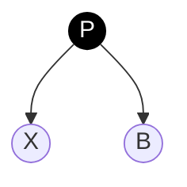
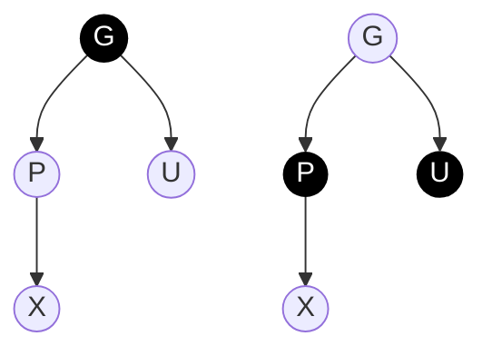
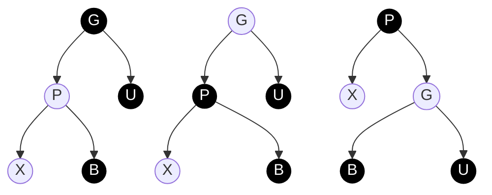
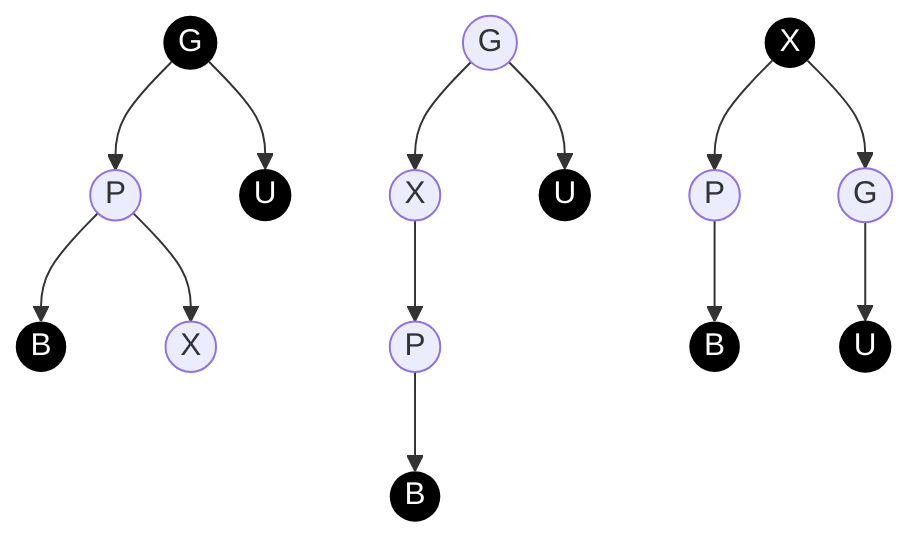

Tree Map

- root: Entry
- comparator
  1. t=this.root
  2. t为null, 就创建新Entry并赋值给this.root上
  3. parent = t
  4. t与k进行比较, 决定left 或是 right
  5. addEntry()
  6. Entry{left,right,parent, key,value, color:BLACK}
  7. fixAfterInsertion


# 红黑树

## 性质

1. 节点是红或者黑
2. 根节点为黑
3. 叶子节点(NIL节点), 都是黑色
4. 红节点的两个孩子节点都是黑色(从叶子到根的所有路径上不存在两个连续的红色节点)
5. 任意一节点到每一个叶子节点所有路径包含相同的黑色节点

## 自平衡策略

- **左旋**
  对于当前节点, 如果右子节点为红, 左子节点为黑, 则进行左旋
  
  ```mermaid
  graph TB
  P((P))
  L((L))
  R((R))
  RR((RR))
  RL((RL))
  P-->L
  P-->R
  R-->RL
  R-->RR
  
  P2((P))
  L2((L))
  R2((R))
  RR2((RR))
  RL2((RL))
  P2-->L2
  P2-->RL2
  R2-->P2
  R2-->RR2
  ```
  
- **右旋**
  对于当前结点, 如果左子, 左孙子结点均为红色, 则执行右旋转
- **变色**
  对于当前结点, 如果左, 右子结点均为红色, 则执行变色

## 插入策略

- 新插入的节点一律为红

- 新插入节点是根节点
  插入后, 违背[性质2](#性质), 根节点不能为黑
  执行变色操作
  
- 父节点为黑直接插入



- 如果父类是祖父的左节点
  - 如果叔叔点是红色
    父节点, 叔叔节点, 祖父节点全部变色
    当前节点左边移动到祖父节点
  - 如果叔叔节点是黑色
    - 当前节点是父节点的右节点
      将当前节点切换为父节点
      左旋当前节点(切换后的父节点)
      当前节点的父节点变黑
      当前节点的祖父节点变红
      右旋当前节点的祖父节点









当前节点为根节点：

​	根节点直接变黑

当前节点的父节点是黑：

​	什么都不做

当前节点的父节点、叔父节点都是红色的：

​	1.父节点、叔父节点都变为黑色

​	2.祖父节点变为红色

​	3.指针移动到祖父节点，继续判断

当前节点父节点为红，叔父节点为黑，当前节点靠近叔父节点：

​	1.指针移动到父节点

​	2.以父节点为支点，向叔父节点相反方向旋转

当前节点父节点为红，叔父节点为黑，当前节点远离叔父节点：

​	1.指针移向父节点，父节点变为黑色

​	2.指针移向祖父节点，祖父节点变为红色

​	3以祖父节点为支点，向叔父节点方向旋转

 

最后一步，总能保证最上层节点为黑色。所以最多经历三步变化总能保证红黑树特性

 